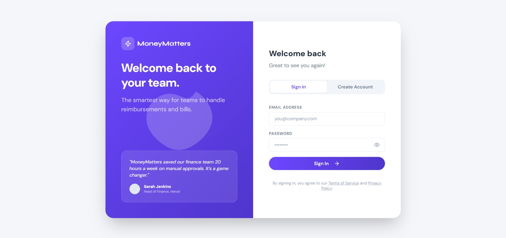
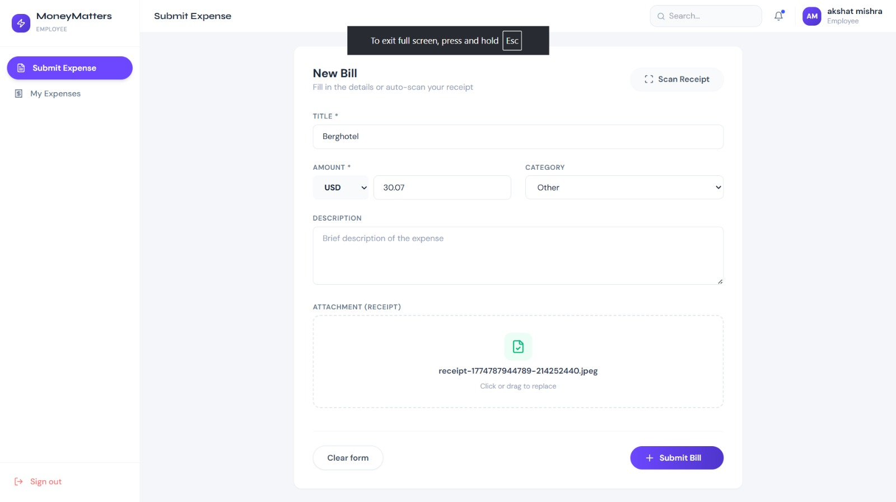
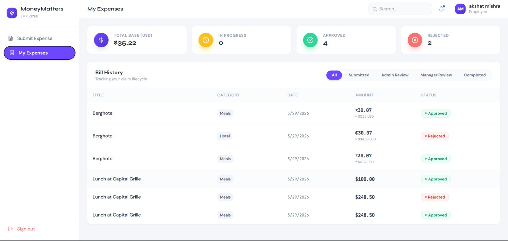
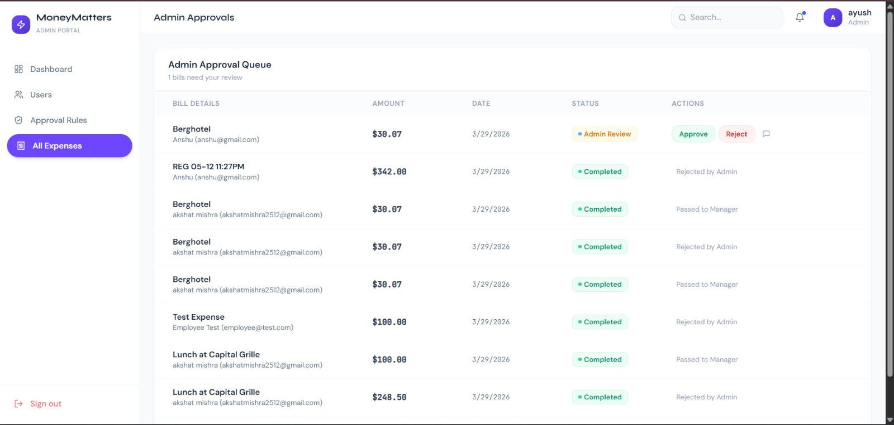

# 💸 MoneyMatters — The Smart Nucleus of Company Spend

[](https://drive.google.com/drive/folders/1Wbd0O7VJGeuyXZsQ53CaUaiqjkp6ZnIX)
[](https://github.com/akshat2512/MoneyMatters)
[](LICENSE)

**MoneyMatters** is an end-to-end, automated expense reimbursement SaaS designed to transform how organizations manage corporate spending. Built with a focus on **AI-driven intelligence**, **scalable architecture**, and **seamless monetization**, it handles the entire expense lifecycle—from instant OCR scanning to multi-stage approval workflows.

---

## 🚀 The Vision

Traditional reimbursement processes are broken: manual data entry, high fraud risk, and opaque approval chains. **MoneyMatters** serves as the intelligent bridge, automating financial compliance while providing real-time insights for administrators and instant payouts for employees.

---

## 🔥 Advanced Features

### 🧠 Intelligence & Automation
- **AI Fraud Detection System**: Automatically flags suspicious activity including **duplicate receipts**, **rapid-fire submissions**, and **unusual spending patterns**.
- **Intelligent OCR Engine**: Powered by Tesseract.js, the system extracts merchants, amounts, and dates from receipts with high precision, eliminating manual entry.
- **Smart Analytics**: A comprehensive dashboard providing visual spend breakdown, category insights, and financial forecasting.

### 💸 SaaS Monetization & Scale
- **Tiered Subscription System**: Fully functional **Free**, **Pro**, and **Enterprise** plans with granular feature gating.
- **Razorpay Integration**: End-to-end payment flow supporting subscription-like behavior and automatic plan unlocking.
- **Multi-Tenant Architecture**: Engineered for isolation, allowing multiple companies to operate securely within the same ecosystem.

### 📦 Productivity Tools
- **Multi-Receipt Batch Upload**: Process up to **6 receipts simultaneously**, significantly reducing time-to-reimbursement.
- **Dynamic Approval Pipeline**: Role-Based Access Control (RBAC) with a sequential workflow (Employee → Manager → Admin).
- **Global Currency Support**: Automatic detection and conversion using real-time exchange rates.

---

## 🏗️ System Architecture

MoneyMatters is built on a modular, secure, and highly scalable foundation:

- **Frontend**: A premium React.js experience utilizing **Tailwind CSS** for modern aesthetics and **Framer Motion** for high-end micro-interactions.
- **Backend**: A robust Node.js/Express core featuring **Modular Middleware** for secure authentication and real-time feature gating.
- **Database**: PostgreSQL with complex relational schema for managing multi-tenant data, fraud logs, and approval histories.
- **Security**: JWT-based authentication combined with secure SHA256 HMAC signature verification for all payment transactions.

---

## 🎯 Why This Project Stands Out

Built entirely as a solo-developer project, **MoneyMatters** isn't just a prototype—it’s a production-ready simulation of a real-world SaaS startup.

1.  **Product Thinking**: Every feature is designed with a "customer-first" mindset, from the landing page to the billing tiers.
2.  **Technical Depth**: Implements advanced concepts like **AI fraud logic**, **automated OCR pipelines**, and **secure third-party payment integrations**.
3.  **End-to-End Execution**: Handles everything from database migrations and backend logic to high-fidelity UI design.

---

## 🎥 Demo & Visuals

### [Watch the Full Product Walkthrough](https://drive.google.com/drive/folders/1Wbd0O7VJGeuyXZsQ53CaUaiqjkp6ZnIX)

<div align="center">
  
</div>

<details>
<summary>📸 Internal Snapshots</summary>

| Login & Auth | Smart OCR Scanning |
| :--- | :--- |
|  |  |

| Employee Dashboard | Admin Approval Panel |
| :--- | :--- |
|  |  |

</details>

---

## 🛠️ Tech Stack

- **Languge**: JavaScript (ES6+)
- **Frontend**: React, Tailwind CSS, Framer Motion, Lucide Icons
- **Backend**: Node.js, Express.js
- **Database**: PostgreSQL (PG-Pool)
- **Services**: Tesseract.js (OCR), Razorpay SDK (Payments), ExchangeRate-API

---

## 🏁 Installation & Setup

1.  **Clone the Repository**
    ```bash
    git clone https://github.com/akshat2512/MoneyMatters.git
    cd MoneyMatters
    ```

2.  **Environment Configuration**
    Create a `.env` in the `backend` folder:
    ```env
    DB_USER=postgres
    DB_NAME=reimbursement
    JWT_SECRET=your_secret
    RAZORPAY_KEY_ID=your_key
    RAZORPAY_KEY_SECRET=your_secret
    ```

3.  **Run the Project**
    ```bash
    # Backend
    cd backend
    npm start
    
    # Frontend
    cd frontend
    npm start
    ```

---

*Designed and Developed with ❤️ by Akshat Mishra*
